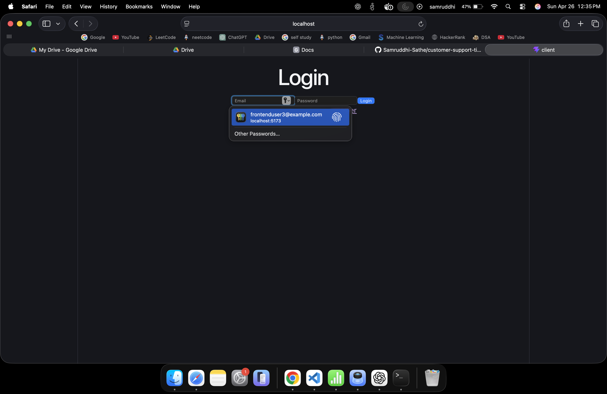
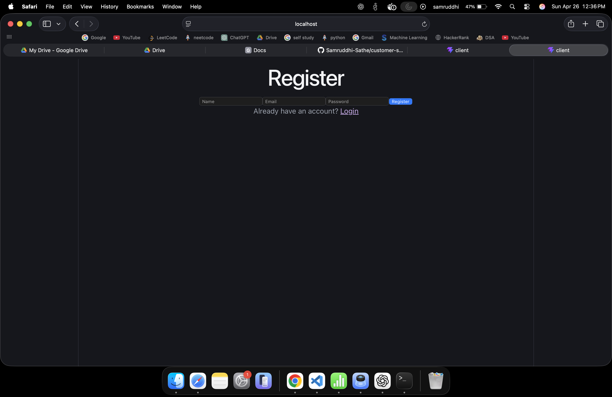
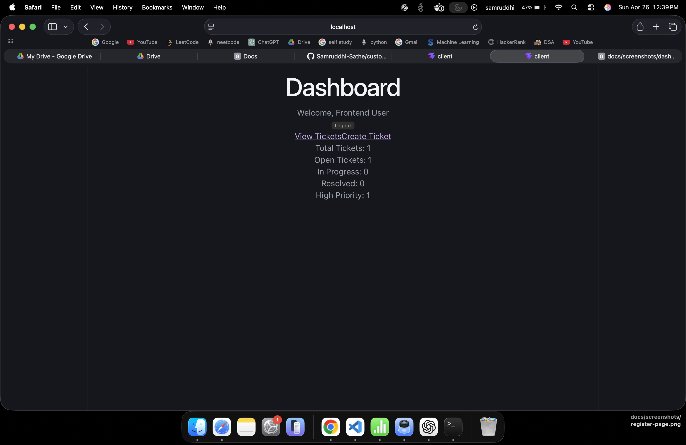
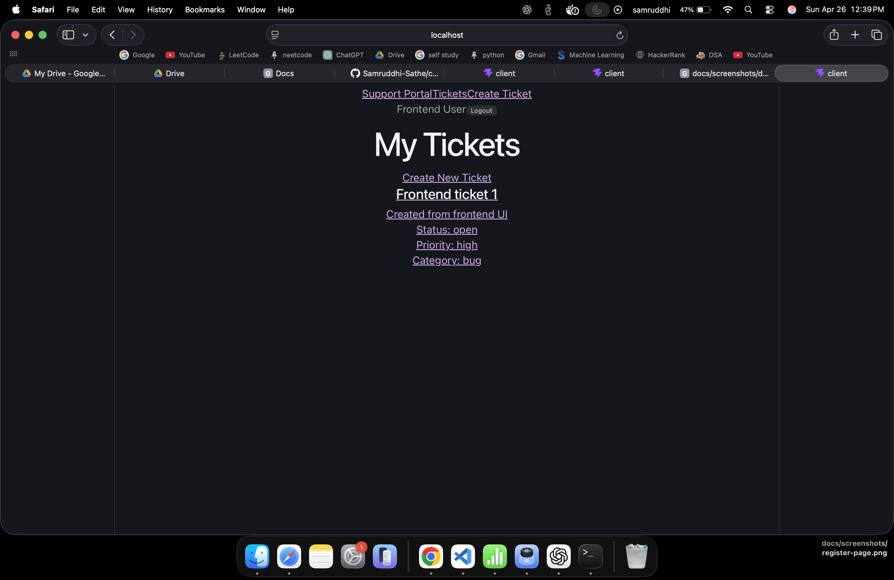

# Customer Support Ticket Portal

A full-stack customer support ticket management application where users can register, log in, create support tickets, update ticket progress, and add comments. The application includes JWT-based authentication, user-specific access control, and a dashboard for tracking ticket status.

## Screenshots

> Screenshots are available in the `docs/screenshots` folder.

### Login Page


### Register Page


### Dashboard


### Create Ticket Page


### Tickets Page
The tickets page displays all support tickets created by the logged-in user, including ticket title, description, status, priority, and category.

### Ticket Details Page
The ticket details page shows complete ticket information, supports status updates, and includes a comments section for tracking discussion or resolution progress.

## Features

- User registration and login
- JWT-based authentication
- Password hashing with bcrypt
- Protected frontend routes
- Protected backend APIs
- Create, read, update, and delete support tickets
- Ticket status, priority, and category support
- Add and view comments on tickets
- Dashboard summary for ticket metrics
- User-specific access control so users only access their own tickets
- Loading, empty, and error states for better user experience

## Tech Stack

### Frontend

- React
- TypeScript
- Vite
- Tailwind CSS
- React Router
- Axios

### Backend

- Node.js
- Express
- TypeScript
- Prisma ORM
- PostgreSQL
- JWT
- bcrypt

## Project Structure

```text
customer-support-ticket-portal/
├── client/
│   ├── src/
│   ├── package.json
│   └── .env.example
├── server/
│   ├── prisma/
│   ├── src/
│   ├── package.json
│   └── .env.example
├── docs/
│   └── screenshots/
└── README.md
```

## Local Setup

### Prerequisites

Make sure you have installed:

- Node.js
- npm
- PostgreSQL
- Git

### 1. Clone the repository

```bash
git clone https://github.com/Samruddhi-Sathe/customer-support-ticket-portal.git
cd customer-support-ticket-portal
```

### 2. Backend setup

```bash
cd server
npm install
```

Create a `.env` file inside `server/`:

```env
DATABASE_URL=your_postgresql_connection_string
JWT_SECRET=your_jwt_secret
PORT=5001
CLIENT_URL=http://localhost:5173
```

Run Prisma migration:

```bash
npx prisma migrate dev
npx prisma generate
```

Start the backend:

```bash
npm run dev
```

Backend runs on:

```text
http://localhost:5001
```

Health check:

```text
http://localhost:5001/health
```

### 3. Frontend setup

Open a new terminal:

```bash
cd client
npm install
```

Create a `.env` file inside `client/`:

```env
VITE_API_BASE_URL=http://localhost:5001/api
```

Start the frontend:

```bash
npm run dev
```

Frontend runs on:

```text
http://localhost:5173
```

## Environment Variables

### client/.env

```env
VITE_API_BASE_URL=http://localhost:5001/api
```

### server/.env

```env
DATABASE_URL=your_postgresql_connection_string
JWT_SECRET=your_jwt_secret
PORT=5001
CLIENT_URL=http://localhost:5173
```

## API Routes

### Auth

| Method | Route | Description |
|---|---|---|
| POST | `/api/auth/register` | Register a new user |
| POST | `/api/auth/login` | Login user and return JWT |
| GET | `/api/auth/me` | Get current logged-in user |

### Tickets

| Method | Route | Description |
|---|---|---|
| POST | `/api/tickets` | Create a ticket |
| GET | `/api/tickets` | Get all tickets for logged-in user |
| GET | `/api/tickets/:id` | Get one ticket |
| PUT | `/api/tickets/:id` | Update ticket |
| DELETE | `/api/tickets/:id` | Delete ticket |

### Comments

| Method | Route | Description |
|---|---|---|
| POST | `/api/tickets/:id/comments` | Add comment to ticket |
| GET | `/api/tickets/:id/comments` | Get comments for ticket |

### Dashboard

| Method | Route | Description |
|---|---|---|
| GET | `/api/dashboard/summary` | Get ticket summary counts |

## Core Data Model

### User

- id
- name
- email
- passwordHash
- createdAt
- updatedAt

### Ticket

- id
- title
- description
- status
- priority
- category
- createdAt
- updatedAt
- createdById

### Comment

- id
- content
- createdAt
- updatedAt
- ticketId
- userId

## What This Project Demonstrates

- Full-stack application development
- Frontend and backend integration
- Secure authentication using JWT
- Password hashing with bcrypt
- REST API design
- Relational database modeling with Prisma and PostgreSQL
- Protected APIs and user-specific authorization
- Practical CRUD workflow
- Monorepo-style project organization
- Interview-ready project documentation

## Demo Flow

A reviewer can run the app locally and test this flow:

1. Register a new user
2. Login
3. View dashboard summary
4. Create a ticket
5. Open the tickets list
6. Open ticket details
7. Add a comment
8. Update ticket status
9. Logout
10. Try opening a protected route and confirm redirect to login

## Future Improvements

- Ticket filtering and search
- Pagination
- Admin/support staff role
- Ticket assignment
- Email notifications
- File attachments
- Toast notifications
- Cloud deployment
- Automated tests